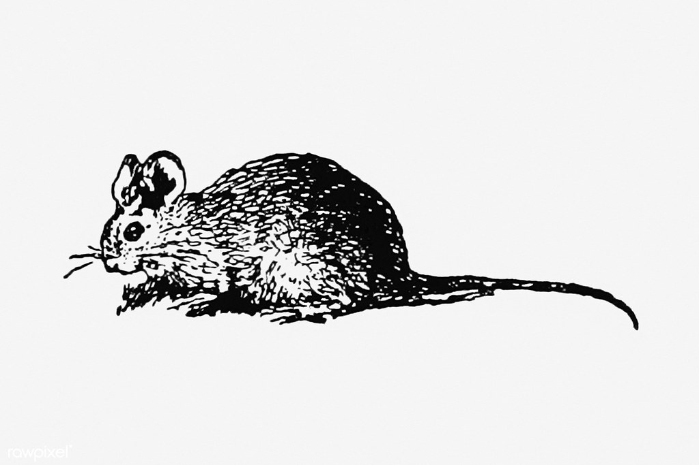

<h1> LeSol - Restaurant </h1>

I made a themed restaurant about a fancy restaurant, where you exclusively eat things that were found on the ground in Brussels, (and one branch in Ostend)

 

<h2>Live Page</h2>

Here's the live page : [LIVE](https://kimjacobus.github.io/lesol/)

<h2>Technologies used</h2>

- `Bootstrap` 
front-end toolkit

- `Vite` 
compiler

<h2>Fonts used</h2>

fonts used from : velvetyne.fr

- `Gulax`
By Morgan Gilbert

- `Victorianna`
By Sébasties Hayez, Jérémy Landes

<h2>Contact</h2>

- jacobus.kim@gmail.com

----

